# Etincelle

A personalized learning platform for the whole family. Three portals, three learners, one shared home — each with tailored content, adaptive difficulty, and progress tracking.

Hosted on our LAN with HTTPS, accessible from any device in the house.

  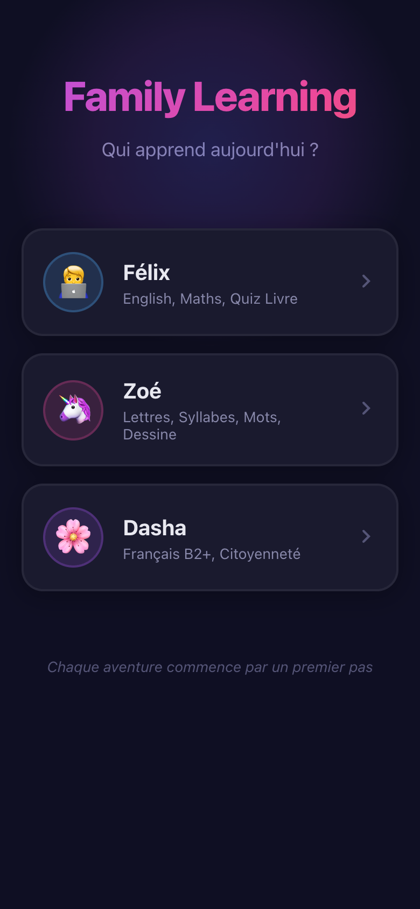

---

## Felix (12 ans) — Felix Academy

English vocabulary, maths (collège/lycée), and book quizzes with spaced repetition (SM-2) driving every session.

  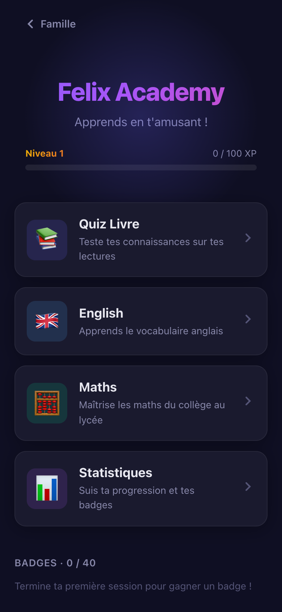
  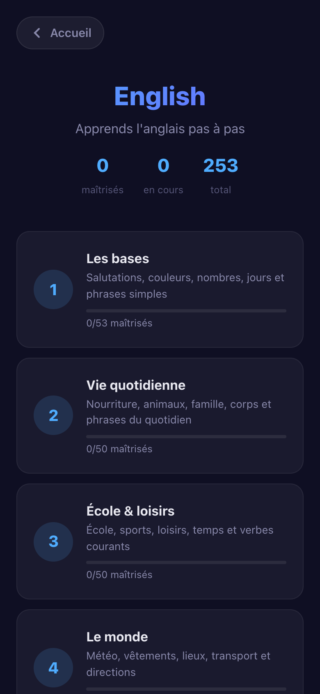
  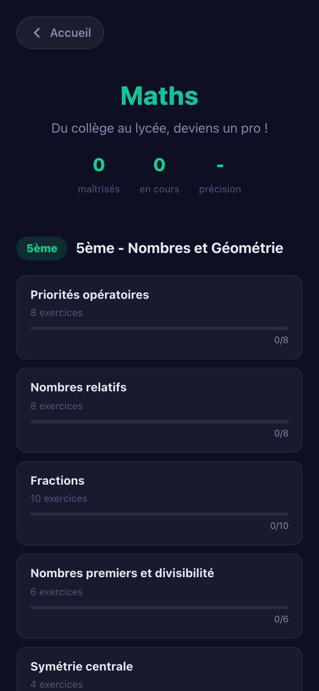

**English** — 253 words across 5 themed levels (basics, daily life, school, world, advanced). Five game types rotate each session: flashcards, translate, fill-the-blank, match pairs, listen & type.

**Maths** — Exercises from 5e to 2nde: fractions, algebra, geometry, functions, statistics. Procedurally generated problems with step-by-step feedback.

**Quiz Livre** — Reading comprehension quizzes on French literature (Jules Verne, Albert Robida). QCM, vrai/faux, associations, timeline ordering, and "qui suis-je" — each answer backed by direct quotes from the source text.

  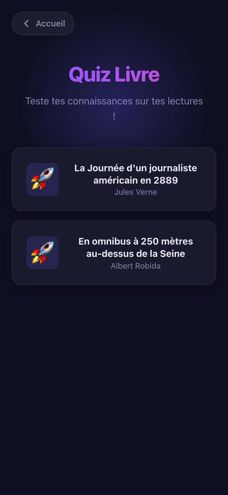
  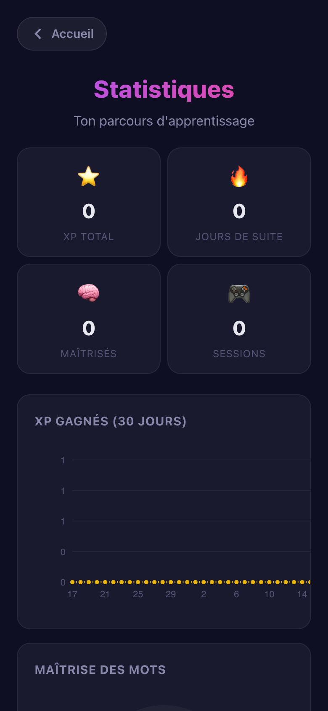

---

## Zoe (5 ans) — Apprends a Lire

A colorful, unicorn-guided French reading journey — letters, syllables, words, drawing, and AI-powered pronunciation checking.

  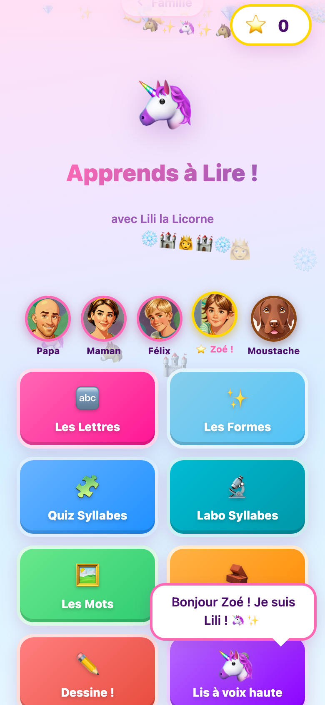

**8 game modes:**
- **Les Lettres** — Learn letter names and sounds with family member associations (F = Felix, M = Moustache the dog...)
- **Les Formes** — Match letters to their shapes
- **Quiz Syllabes** — Identify syllables by sound
- **Labo Syllabes** — Build syllables by combining consonants and vowels
- **Les Mots** — Read whole words with TTS support
- **Dessine !** — Draw letters on a canvas, recognized in real-time by an EMNIST neural network (ONNX Runtime, runs entirely in-browser)
- **Lis a voix haute** — Read aloud and get feedback from Whisper (speech recognition running locally via Transformers.js, no cloud API)

Adaptive difficulty with a tier system: items progress through "new > learning > known > mastered" based on streaks. Cartoon family avatars generated with SDXL-Turbo.

---

## Dasha (Maman) — Francais B2+ & Citoyennete

Advanced French vocabulary and French citizenship test preparation.

  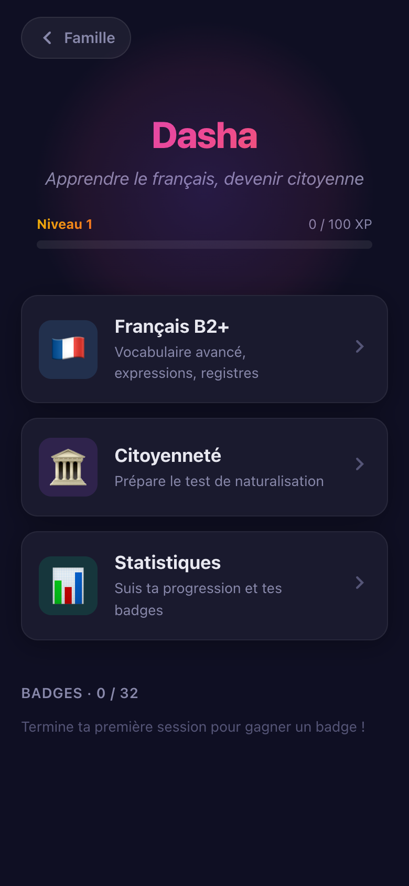
  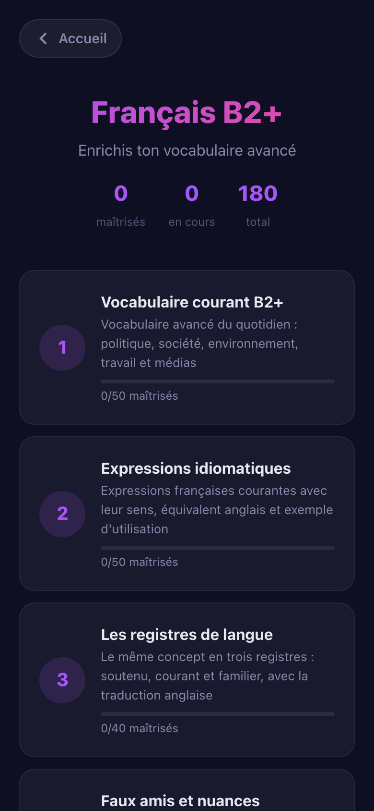
  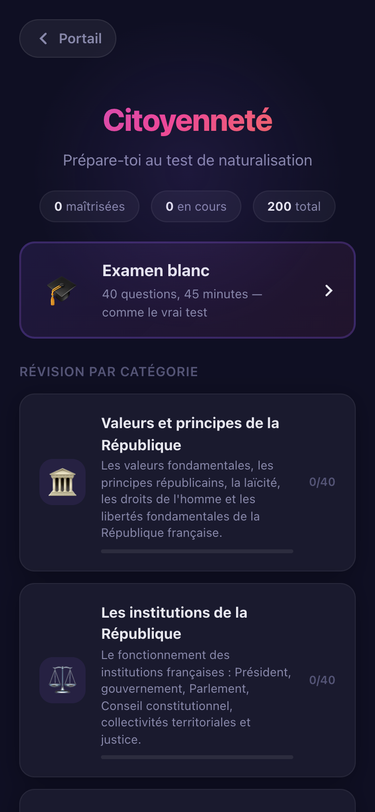

**Francais B2+** — 180 items across 4 levels:
1. Vocabulaire courant avance (politique, societe, environnement)
2. Expressions idiomatiques & proverbes
3. Registres de langue (soutenu, courant, familier)
4. Faux amis & nuances anglais-francais

**Citoyennete** — 200 questions preparing for the French naturalization test:
- *Examen blanc* — Full 40-question mock exam with 45-minute timer (pass = 32/40)
- *Revision par categorie* — Valeurs & principes, Institutions, Droits & devoirs, Histoire & geographie, Vivre en France
- Game types: QCM, vrai/faux, flashcards, timeline ordering, qui suis-je

  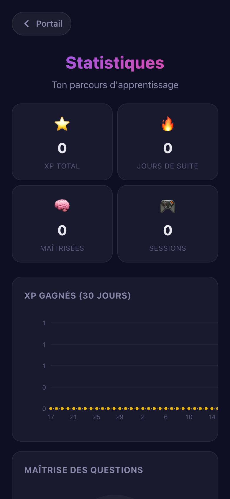

---

## Technical Highlights

- **100% static** — Pure HTML/CSS/JS, no build step, no server-side logic. Served by nginx over HTTPS on a LAN machine.
- **Runs offline** — All assets bundled locally. AI models (Whisper, EMNIST) run in-browser via ONNX Runtime and Transformers.js.
- **Spaced repetition (SM-2)** — Shared engine for Felix and Dasha. Items resurface at optimal intervals based on performance.
- **Gamification** — XP, levels, streaks, and 40+ badges per user. Confetti, sound effects, and Lottie animations on achievements.
- **User-scoped storage** — Each family member gets their own IndexedDB database. Progress is completely isolated.
- **Auto-deployed** — Push to GitHub, server pulls every 5 minutes via cron.
- **Mobile-first** — Designed for phones and tablets. Dark theme across all portals.

## Stack

| Layer | Tech |
|-------|------|
| Frontend | Vanilla JS (ES modules), CSS custom properties |
| AI / ML | ONNX Runtime (WASM), Transformers.js (Whisper), SDXL-Turbo (avatars) |
| Storage | IndexedDB (per-user databases) |
| Hosting | nginx + Let's Encrypt (DNS-01 via Cloudflare) |
| Deployment | GitHub + cron git pull |

## Hosting

100% static — just point any web server at the repo root over HTTPS. See [HOSTING.md](HOSTING.md) for setup instructions and a sample nginx config.

## License

Private family project.
